> "Stats not speak for me."

<picture>
  <source media="(prefers-color-scheme: dark)" srcset="https://raw.githubusercontent.com/mrcode-sys/mrcode-sys/testing/profile/github-snake-dark.svg" />
  <source media="(prefers-color-scheme: light)" srcset="https://raw.githubusercontent.com/mrcode-sys/mrcode-sys/testing/profile/github-snake.svg" />
  
</picture>
